# Recurrent Neural Network for sentence-level Text Classification

This project is about building and evaluating recurrent neural network models
for sentence-level text classification. The final models detect toxicity in
short texts as well as the type of toxicity, which include the following
categories: severe toxicity, obscene, identity attack, insult, and threat.
The final models can be used for filtering online posts and comments,
social media policing, and user education.
 
### Links
- [The deployed models](TODO)

### Sections
- [Dataset Summary](#dataset-summary)
- [Exploratory Data Analysis](#exploratory-data-analysis)
- [Models](#models)
- [Training](#training)
- [Evaluation](#evaluation)
- [Testing](#testing)

## Dataset Summary
[back to top](#sections)

-  1.8+ million user comments dataset was downloaded from the [Kaggle competition labeled 'Jigsaw Unintended Bias in Toxicity Classification'](https://www.kaggle.com/c/jigsaw-unintended-bias-in-toxicity-classification).
- The dataset consists of 1.8+ million user comments that have been hand-labeled by human raters for toxicity levels.
- The dataset also includes the following toxicity types: severe toxicity,  obscene, threat, insult, and identity attack.
 
 

## Exploratory Data Analysis
[back to top](#sections)

###  Toxicity class distribution
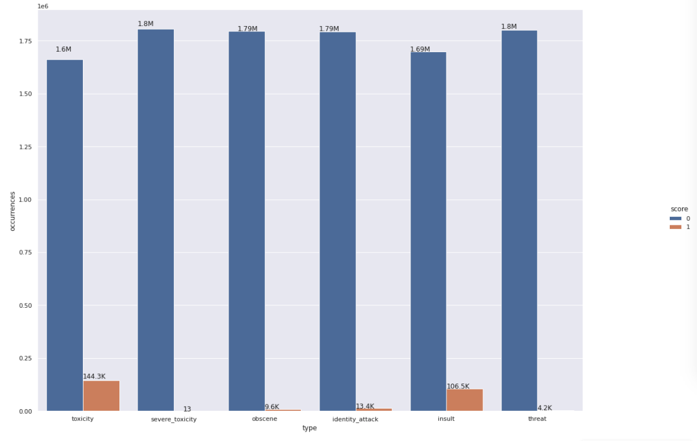

### Correlation heatmap of types
 
 

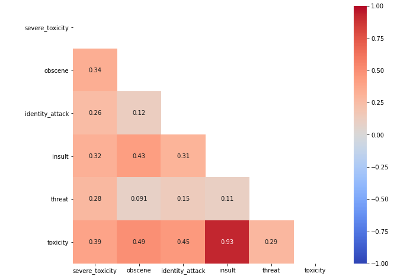

 
 

## Models
[back to top](#sections)

### Long Short-Term Memory Model (LSTM)
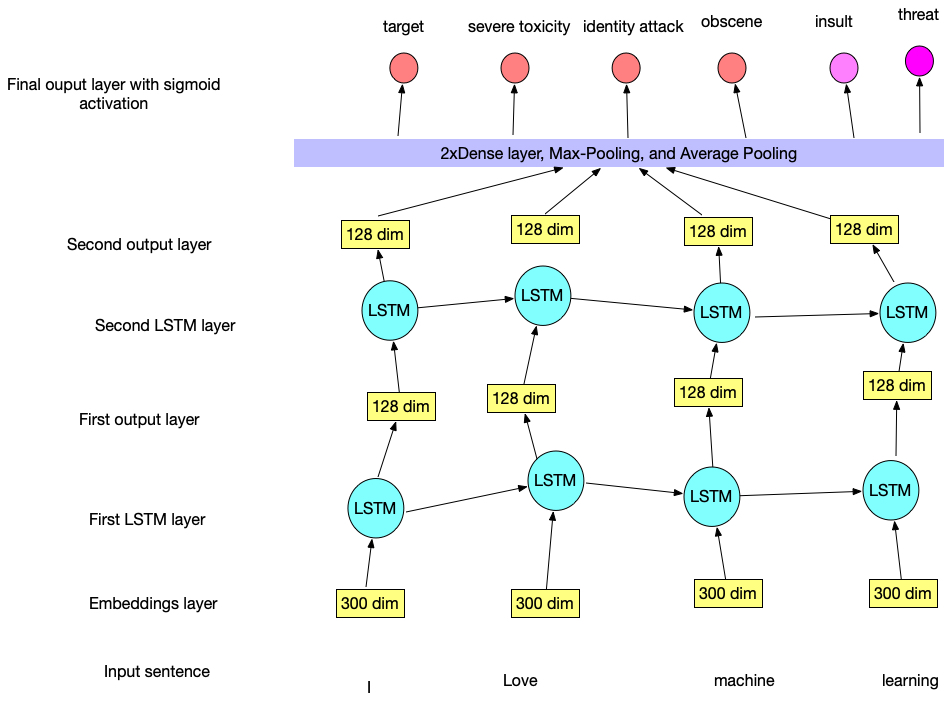

 

### Bidirectional Long Short-Term Memory Model (BiLSTM)

 
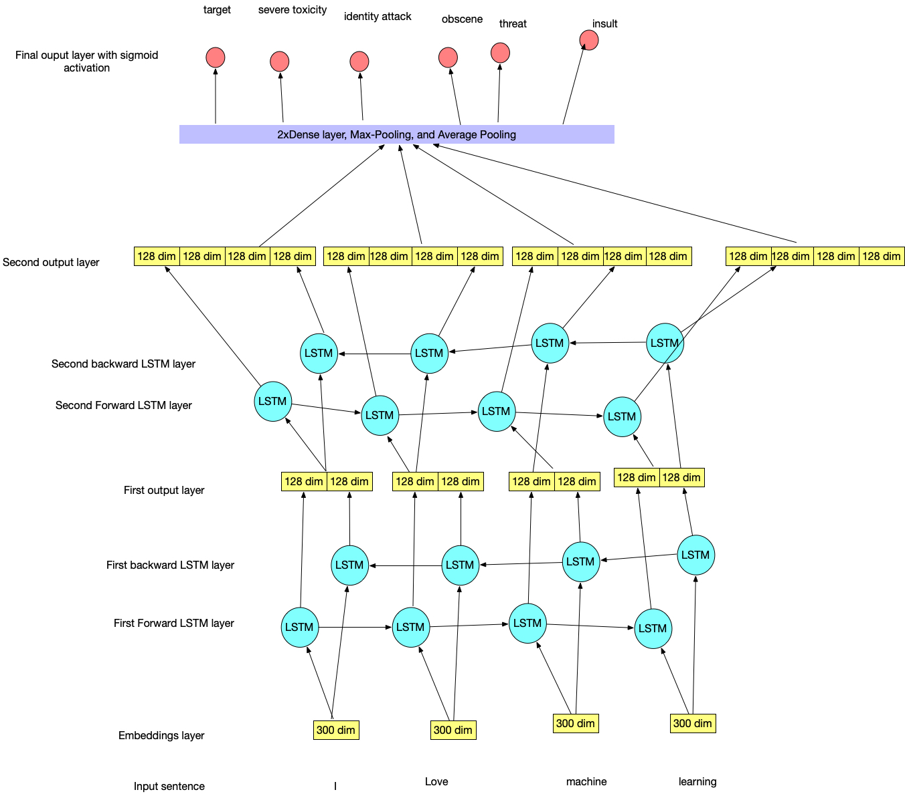

 

### BiLSTM with Attention Mechanism
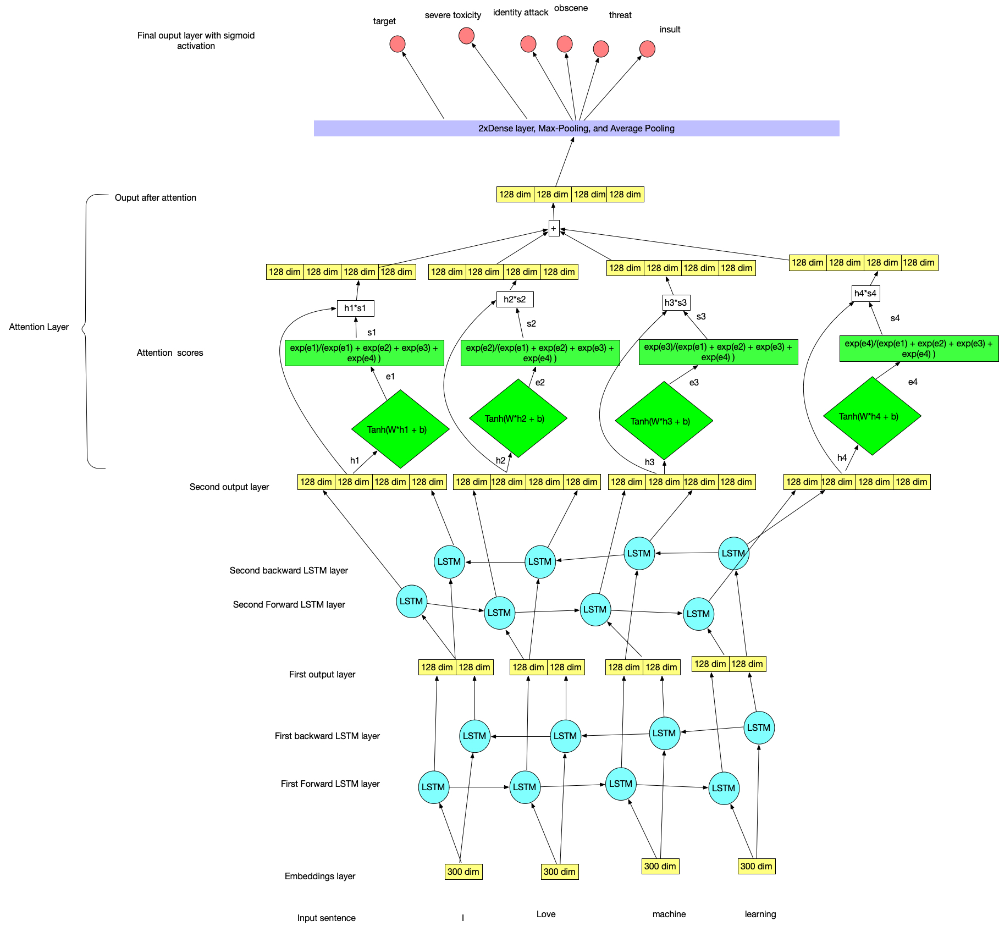

 
 

## Training
[back to top](#sections)

### Learning Curves

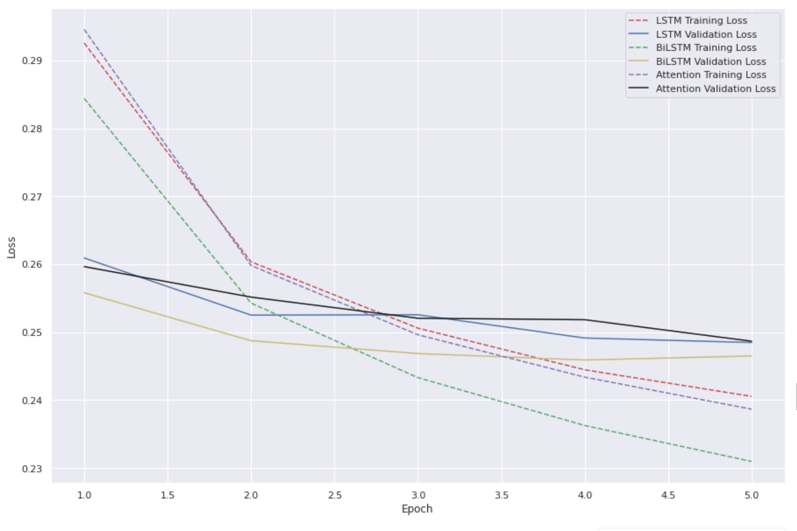

 
 

## Evaluation
[back to top](#sections)
 

### ROC-AUC Toxicity
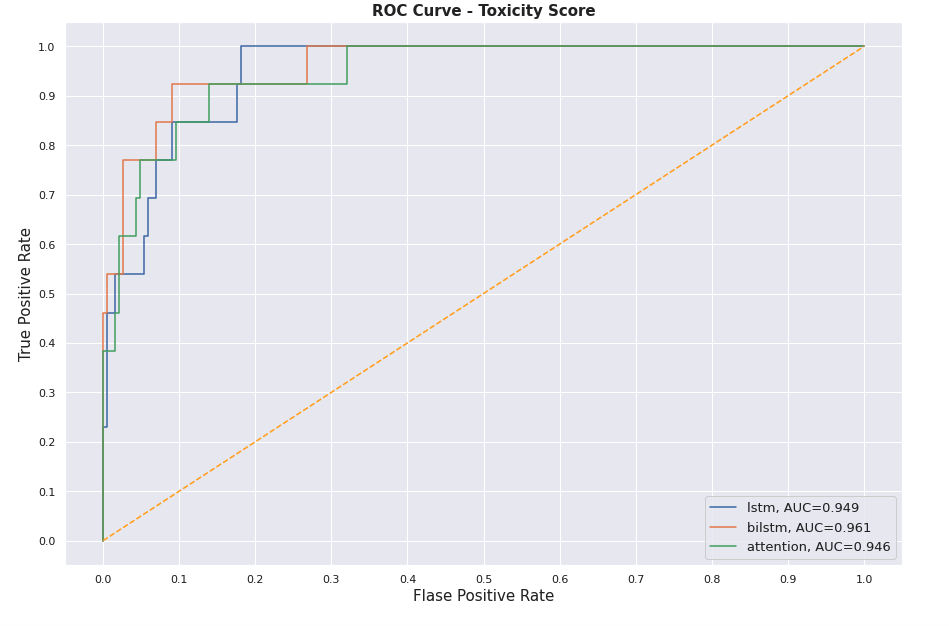

### ROC-AUC Severe Toxicity
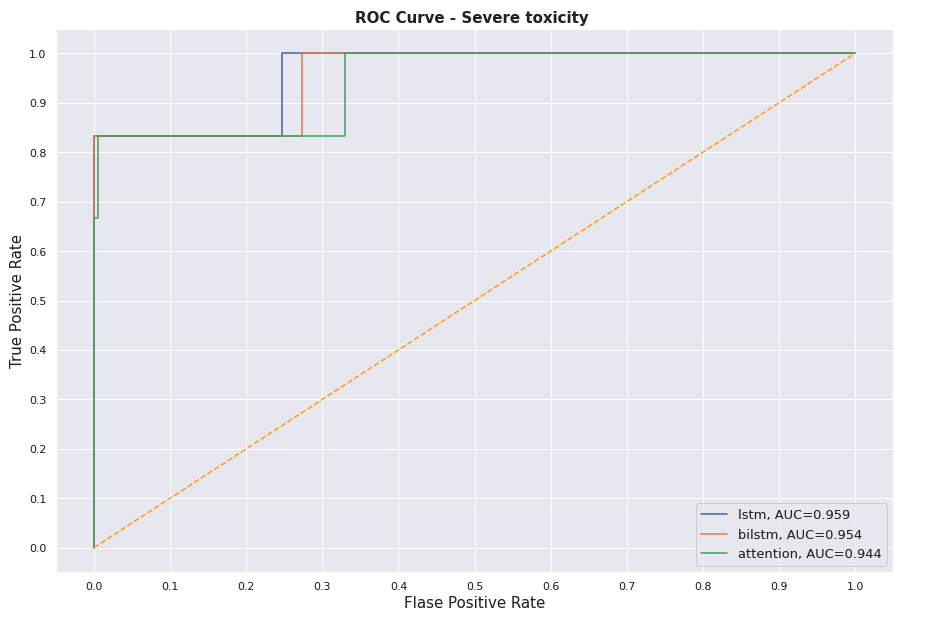
### ROC-AUC Obscene
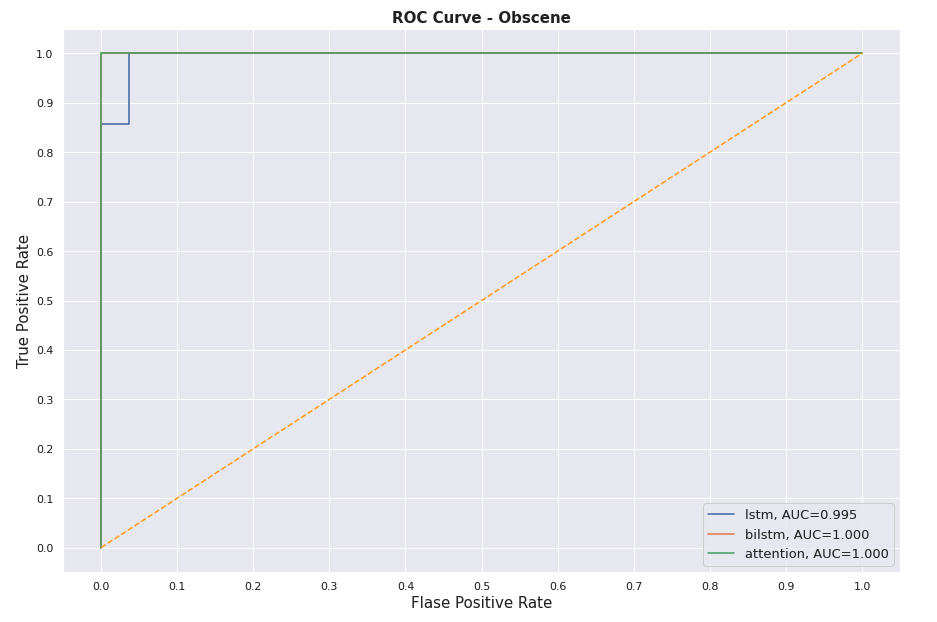
### ROC-AUC Identity Attack
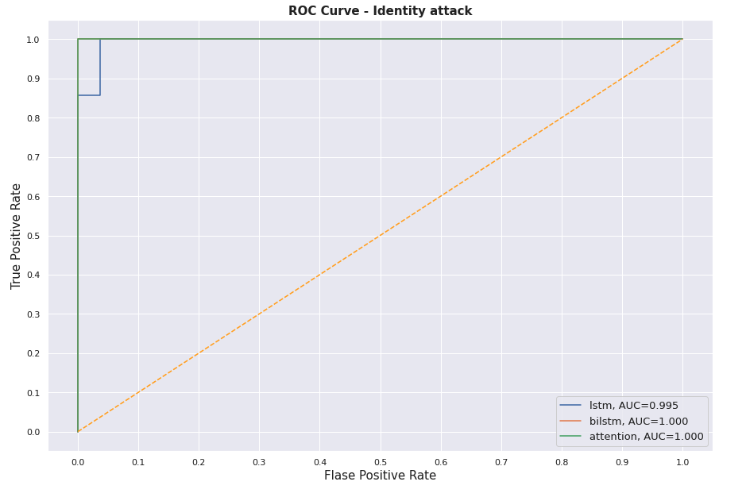
### ROC-AUC Insult
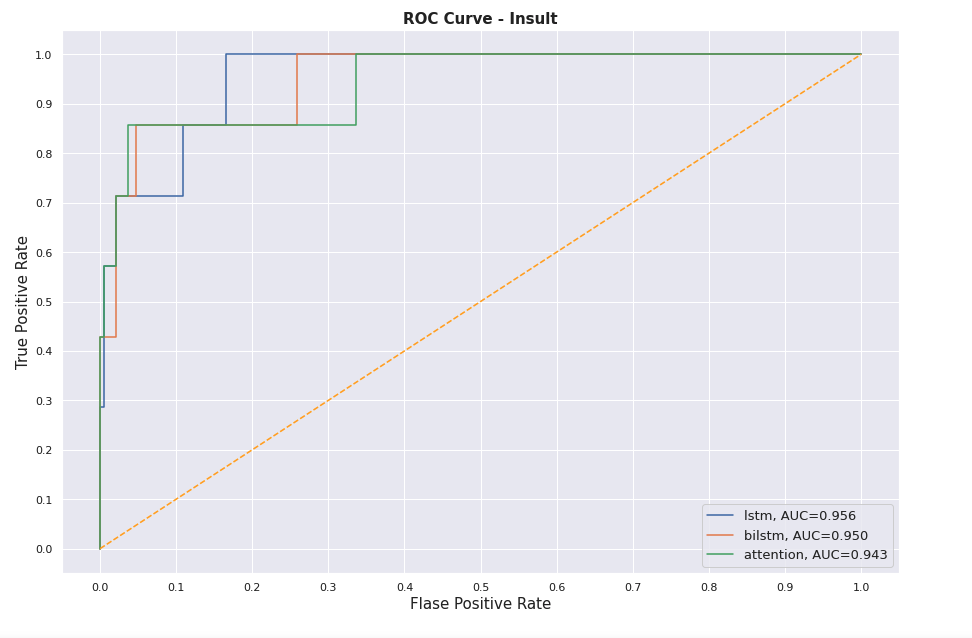
### ROC-AUC Threat
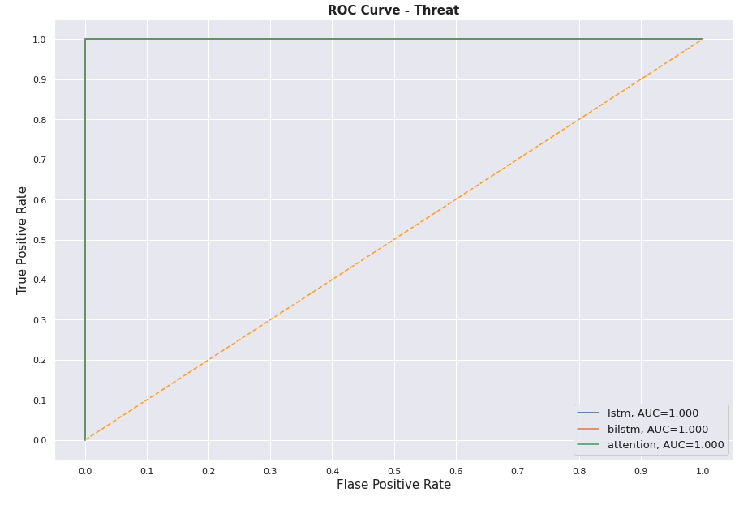
 
## Testing
[back to top](#sections)
 

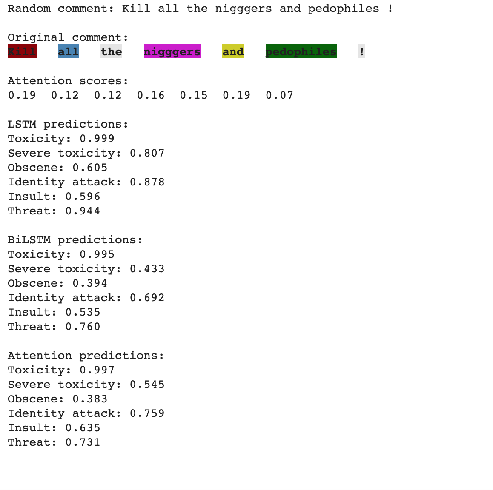

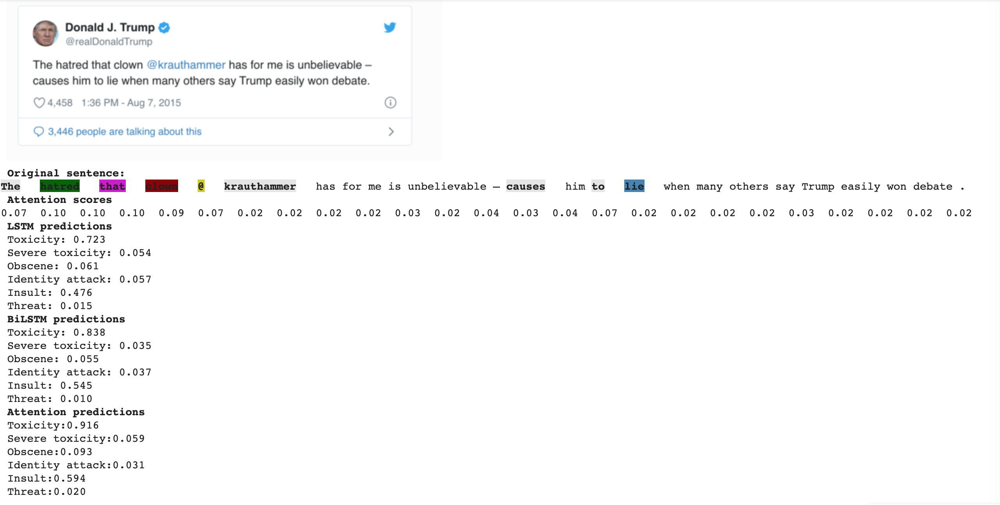

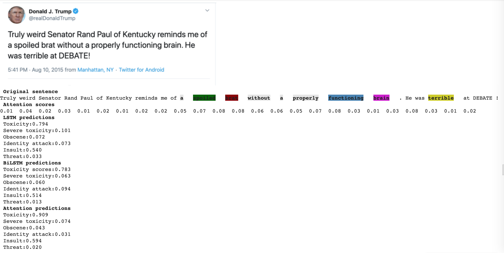

